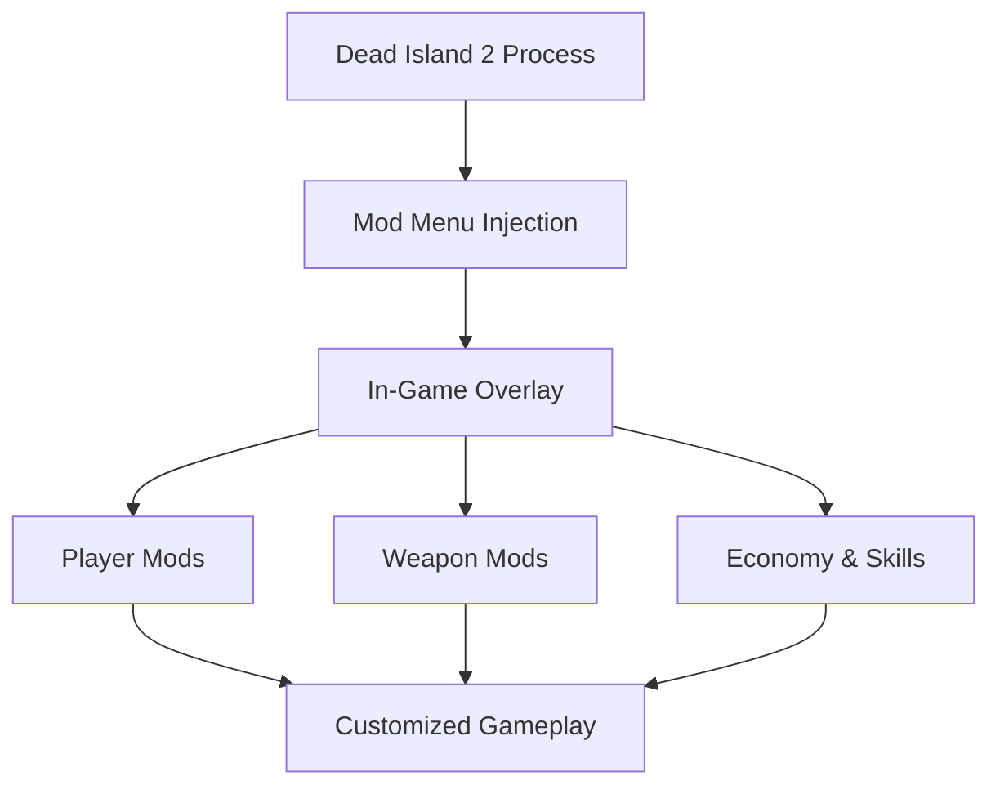

# Dead Island 2 Mod Menu

Dead Island 2 is a postcard from the apocalypse — sun-bleached, loud, and dripping with excess.
Zombies stumble through neon streets like bad memories that refuse to fade.
**Dead Island 2 Mod Menu** doesn’t clean the mess. It hands you the switches behind it.

A menu not for cheating —
but for *curating chaos*.

---

## 🌴 Overview

Dead Island 2 Mod Menu is a **live in-game modification hub** that opens a sandbox inside the sandbox. It appears as an overlay during gameplay, letting you toggle powers, reshape combat, and bend progression without restarting or damaging saves.

Think of it as a director’s console:
pause the struggle, adjust the scene, let the blood keep flowing — your way.

---

## 🧩 Mod Menu Highlights

### ❤️ Player Control

* God Mode toggle
* Infinite stamina
* No fall or elemental damage
* Adjustable movement speed

### ⚔ Weapons & Combat

* Infinite durability
* Damage multipliers (fine-tuned)
* Instant reload / no reload
* Attack speed control

### 🧠 Skills & Fury

* No cooldowns
* Unlimited Fury mode
* Instant skill activation
* Effect stacking (carefully, beautifully)

### 💰 Economy & Crafting

* Infinite money
* Lock crafting materials
* Free upgrades and mods
* Vendor price overrides

[!NOTE]
Every option lives independently. Chaos is modular — not mandatory.

---

## ⚡ How It Feels to Use

1. Launch the game
2. Inject the Mod Menu
3. Open overlay with a hotkey
4. Toggle features instantly
5. Adjust values mid-fight, mid-laugh

Example cinematic setup:

```text
• Infinite stamina
• Weapon durability locked
• 2.5x damage
• Fury always available
→ Flowing, brutal, stylish combat
```

[!IMPORTANT]
Extreme values can erase tension. Use sliders like spices — not floods.

---

## 🔁 System Flow



Immediate input. Immediate response. No interruptions.

---

## ❓ FAQ

**Is this different from a trainer?**
Yes. The Mod Menu is an always-open overlay, not just hotkeys.

**Can I toggle mods during combat?**
Absolutely. That’s the point.

**Will my save break?**
No — changes live in memory and vanish when you close the game.

**Is it multiplayer-safe?**
It’s designed strictly for single-player use.

**Do I need to enable everything?**
Never. The best chaos is *selective*.

---

## 🌇 Final Words

Dead Island 2 is already absurd.
This Mod Menu simply gives you the reins.

Make Hell-A forgiving.
Make it cruel.
Make it cinematic, ridiculous, effortless, or impossible.

The zombies won’t complain.
They never do.

---
